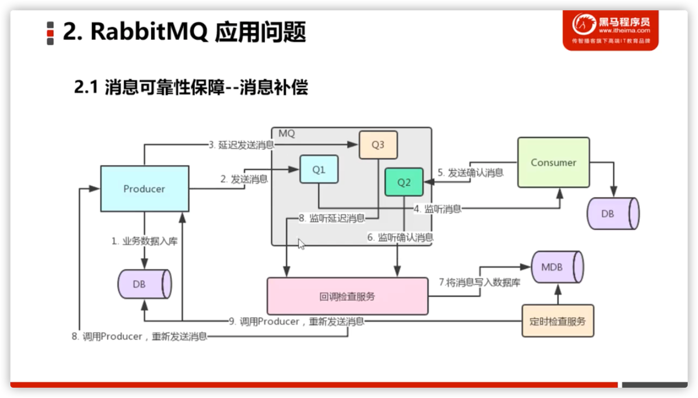

# 安装

```text
docker pull rabbitmq:management

docker run -d --name  axing-rabbitmq -p 5672:5672 -p 15672:15672 -v /app/rabbitmq/data:/var/lib/rabbitmq --hostname myRabbit -e RABBITMQ_DEFAULT_VHOST=/my_vhost  -e RABBITMQ_DEFAULT_USER=admin -e RABBITMQ_DEFAULT_PASS=AXing#631122 df80af9ca0c9

docker run -d --name  axing-rabbitmq -p 5672:5672 -p 15672:15672 -v /app/rabbitmq/data:/var/lib/rabbitmq  -e RABBITMQ_DEFAULT_USER=admin -e RABBITMQ_DEFAULT_PASS=admin df80af9ca0c9

docker run -d --name  axing-rabbitmq -p 5672:5672 -p 15672:15672   -e RABBITMQ_DEFAULT_USER=admin -e RABBITMQ_DEFAULT_PASS=admin

```

# 6种模式 五种模式详解

```text
五种工作模式

这里简单介绍下五种工作模式的主要特点：

简单模式：一个生产者，一个消费者

work模式：一个生产者，多个消费者，每个消费者获取到的消息唯一。

发布订阅模式：一个生产者发送的消息会被多个消费者获取。 Fanout exchange扇形交换机

路由模式：发送消息到交换机并且要指定路由key ，消费者将队列绑定到交换机时需要指定路由key

topic模式：将路由键和某模式进行匹配，此时队列需要绑定在一个模式上，“#”匹配一个词或多个词，“*”只匹配一个词。

新增RabbitMQ死信队列

RabbitMQ要实现延时任务，需要使用RabbitMQ的死信交换机(Exchange)和消息的存活时间TTL(Time To Live)来实现

死信交换机

死信交换机跟普通交换机一样,只是这个交换机用来存放过期的消息

当一个消息没有相对应的消费者对其进行消费, 并且消息设置了TTL,消息过期后会进入死信交换机。

队列的长度限制满了。排在前面的消息会被丢弃或者扔到死信路由上。

当消息进入死信交换机后,死信交换机在把消息转发给专门处理死信消息的消费者,及可实现定时任务

设置消息TTL(消息存活时间)

消息的TTL就是消息的存活时间。RabbitMQ可以对队列和消息分别设置TTL。对队列设置就是队列没有消费者连着的保留时间，也可以对每一个单独的消息做单独的设置。

超过了这个时间，我们认为这个消息就死了，称之为死信。如果队列设置了，消息也设置了，那么会取小的。所以一个消息如果被路由到不同的队列中，这个消息死亡的时间有可能不一样(不同的队列设置

```


```text

一、五种模式详解
1.简单模式(Queue模式)
    没有交换机,一对一

1.2应用场景
常见的应用场景就是一发,一接的结构
例如:
    手机短信
    邮件单发

2.争抢模式(Work模式)
    没有交换机, 一对多,但消费者轮训,同时只有一个接收
2.2应用场景
    抢红包
    资源分配系统

3.发布订阅模式(Pulish/Subscribe模式 Fanout广播)
    有交换机,一对多,不竞争
3.2应用场景

    消息推送
    广告

4.路由模式(Route模式 Direct定向)

    有交换机,一对多,根据 routing key 匹配到队列-消费者
    
    从路由模式开始，关心的就是消息如何到达的队列，路由模式需要使用的交换机类型就是路由交换机（direct）

    生产端：发送消息，在消息中处理消息内容，携带一个routingkey
    交换机：接收消息，根据消息的routing key去计算匹配后端队列的routingkey
    队列：存储交换机发送的消息
    消费端：简单模式 工作争抢

4.2应用场景

    短信
    聊天工具
    邮箱。。
    
5.主题模式(Topics模式 Topic通配符)
    有交换机,一对多,
    路由key值是一种多级路径。中国.四川.成都.武侯区


    生产端：携带路由key，发送消息到交换机

    队列：绑定交换机和路由不一样，不是一个具体的路由key，而可以使用*和#代替一个范围
    | * | 字符串，只能表示一级 |
    | --- | --- |
    | # | 多级字符串 |

    交换机：根据匹配规则，将路由key对应发送到队列

    消息路由key:
        北京市.朝阳区.酒仙桥
        北京市.#: 匹配true
        上海市.浦东区.*: 没匹配false
        新疆.乌鲁木齐.#

5.2 应用场景

    做物流分拣的多级传递.


```

## 注解

```text
@RabbitHandler()  可以参数重载,同一队列,封装不同参数对象
```

```text
自动应答: 不靠谱,因为接收到消息,后面代码可能失败
手动应答:
    消息应答: 
    A.channel.basicAck 用于确认
    A.channel.basicNack 用于否定
    A.channel.basicReject 用于否定(拒绝) 比 basicNack 号同一个参数,不处理改消息 直接拒绝,可以丢弃
    批量应答
```

## 交换机

```text
3种方式
DIRECT 定向
FANOUT 扇形,广播,发送消息到每一个与之绑定的队列
TOPIC 通配符的方式
    符号“#”匹配路由键的一个或多个词，符号“*”匹配路由键的一个词。
    
topic.#那么这个队列会会接收topic开头的消息
topic.*.queue那么这个队列会接收topic.aaaa.queue这样格式的消息，不接收能topic.aaaa.bbbb.queue这样格式的消息

HEADERS 参数匹配
```

# 高级特性

```text

消息可靠性投递
    持久化到本地文件中 exchange queue message 都要持久化
    确认模式 confirmCallback: 只要broker(一般是交换机)收到就会执行,如果是集群模式,需要所有broker收到,并不能保证目标queue会收到
   未投递到queue回退模式 returnCallback:消费者未收到消息后回调
    
    
consumer ACK
    消费端手动确认

消费端限流

TTL
    存活时间
  
    队列统一过期 ,消息单单独过期: 同时设置了,以短的为准
    队列过期:会移除所有消息
    消息过期后,只有消息在队列顶端,才会判断其是否过期,移除
        
死信队列,死信交换机
    无法被消费的消息
    为了保证消息数据不丢失,消费者发生异常时,将消息投入死信队列
    来源: 
        1.队列消息长度达到限制
        2.消费者拒绝消费消息,
        3.原队列存在消息过期设置,消息到达超时未被消费
    

延迟队列

日志监控

消息可靠性追踪

管理

```

# 应用问题

```text
消息可靠性保证

消息补偿:
    生产端同时发送一个延迟延迟消息, 在回调检查服务,消费端接收到消息,发送确认消息,进行回调检查服务中,同时定时检查
消息幂等性


```



## 延迟插件

```text
不采用死信队列延迟, 直接是交换机延迟

死信队列功能: 消息不丢失
```

# 惰性队列

```text
使用在消费者宕机中,存放磁盘中,有性能问题
```

# 为什么创建AnonymousQueue队列

```text
为什么创建AnonymousQueue队列？

1、无论何时当我们链接rabbitmq时我们需要新的、空的队列。使用AnonymousQueue将创建一个带有随机名字的队列或者甚至更好的选择是让服务端为我们选择一个随机队列名给我们。

2、一旦我们客户端断开链接，队列应该自动被删除。spring-amqp客户端为我们做到这点，它定义了一个AnonymousQueue，它是匿名的、不耐用的、独占的、自动删除的队列。
————————————————
版权声明：本文为CSDN博主「Fandy_meng」的原创文章，遵循CC 4.0 BY-SA版权协议，转载请附上原文出处链接及本声明。
原文链接：https://blog.csdn.net/Jack_Brandy/article/details/107811864
```

# 消息丢失,使用firehose和插件

# 集群
