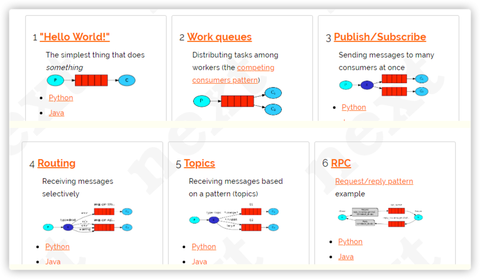

# 安装
```text
docker pull rabbitmq:management

docker run -d --name  axing-rabbitmq -p 5672:5672 -p 15672:15672 -v /app/rabbitmq/data:/var/lib/rabbitmq --hostname myRabbit -e RABBITMQ_DEFAULT_VHOST=/my_vhost  -e RABBITMQ_DEFAULT_USER=admin -e RABBITMQ_DEFAULT_PASS=AXing#631122 df80af9ca0c9

docker run -d --name  axing-rabbitmq -p 5672:5672 -p 15672:15672 -v /app/rabbitmq/data:/var/lib/rabbitmq  -e RABBITMQ_DEFAULT_USER=admin -e RABBITMQ_DEFAULT_PASS=admin df80af9ca0c9

docker run -d --name  axing-rabbitmq -p 5672:5672 -p 15672:15672   -e RABBITMQ_DEFAULT_USER=admin -e RABBITMQ_DEFAULT_PASS=admin

```

# 6种模式 五种模式详解

```text

一、五种模式详解
1.简单模式(Queue模式)

    当生产端发送消息到交换机,交换机根据消息属性发送到队列,消费者监听绑定队列实现消息的接收和消费逻辑编写.简单模式下,强调的一个队列queue只被一个消费者监听消费.


    生产者:生成消息,发送到交换机
    交换机:根据消息属性,将消息发送给队列
    消费者:监听这个队列,发现消息后,获取消息执行消费逻辑

1.2应用场景
常见的应用场景就是一发,一接的结构
例如:
    手机短信
    邮件单发

2.争抢模式(Work模式)

    强调的也是后端队列与消费者绑定的结构
    生产者:发送消息到交换机
    交换机:根据消息属性将消息发送给队列
    消费者:多个消费者,同时绑定监听一个队列,之间形成了争抢消息的效果

2.2应用场景
    抢红包
    资源分配系统

3.发布订阅模式(Pulish/Subscribe模式 Fanout广播)

    不计算路由的一种特殊交换机
3.2应用场景

    消息推送
    广告

4.路由模式(Route模式 Direct定向)

    从路由模式开始，关心的就是消息如何到达的队列，路由模式需要使用的交换机类型就是路由交换机（direct）

    生产端：发送消息，在消息中处理消息内容，携带一个routingkey
    交换机：接收消息，根据消息的routingkey去计算匹配后端队列的routingkey
    队列：存储交换机发送的消息
    消费端：简单模式 工作争抢

4.2应用场景

    短信
    聊天工具
    邮箱。。
    
5.主题模式(Topics模式 Topic通配符)

    路由key值是一种多级路径。中国.四川.成都.武侯区


    生产端：携带路由key，发送消息到交换机

    队列：绑定交换机和路由不一样，不是一个具体的路由key，而可以使用*和#代替一个范围
    | * | 字符串，只能表示一级 |
    | --- | --- |
    | # | 多级字符串 |

    交换机：根据匹配规则，将路由key对应发送到队列

    消息路由key:
        北京市.朝阳区.酒仙桥
        北京市.#: 匹配true
        上海市.浦东区.*: 没匹配false
        新疆.乌鲁木齐.#

5.2 应用场景

    做物流分拣的多级传递.


```

```text
自动应答: 不靠谱,因为接收到消息,后面代码可能失败
手动应答:
    消息应答: 
    A.channel.basicAck 用于确认
    A.channel.basicNack 用于否定
    A.channel.basicReject 用于否定(拒绝) 比 basicNack 号同一个参数,不处理改消息 直接拒绝,可以丢弃
    批量应答
```
## 交换机
```text
3种方式
DIRECT 定向
FANOUT 扇形,广播,发送消息到每一个与之绑定的队列
TOPIC 通配符的方式
    符号“#”匹配路由键的一个或多个词，符号“*”匹配路由键的一个词。
    
topic.#那么这个队列会会接收topic开头的消息
topic.*.queue那么这个队列会接收topic.aaaa.queue这样格式的消息，不接收能topic.aaaa.bbbb.queue这样格式的消息

HEADERS 参数匹配
```

# 高级特性
```text

消息可靠性投递
    持久化到本地文件中 exchange queue message 都要持久化

consumer ACK
    消费端手动确认

消费端限流

TTL
    存活时间
  
    队列统一过期 ,消息单单独过期: 同时设置了,以短的为准
    队列过期:会移除所有消息
    消息过期后,只有消息在队列顶端,才会判断其是否过期,移除
        
死信队列,死信交换机
    无法被消费的消息
    为了保证消息数据不丢失,消费者发生异常时,将消息投入死信队列
    来源: 
        1.队列消息长度达到限制
        2.消费者拒绝消费消息,
        3.原队列存在消息过期设置,消息到达超时未被消费
    

延迟队列

日志监控

消息可靠性追踪

管理

```

# 应用问题
```text
消息可靠性保证

消息幂等性


```


## 延迟插件
```text
不采用死信队列延迟, 直接是交换机延迟

死信队列功能: 消息不丢失
```
